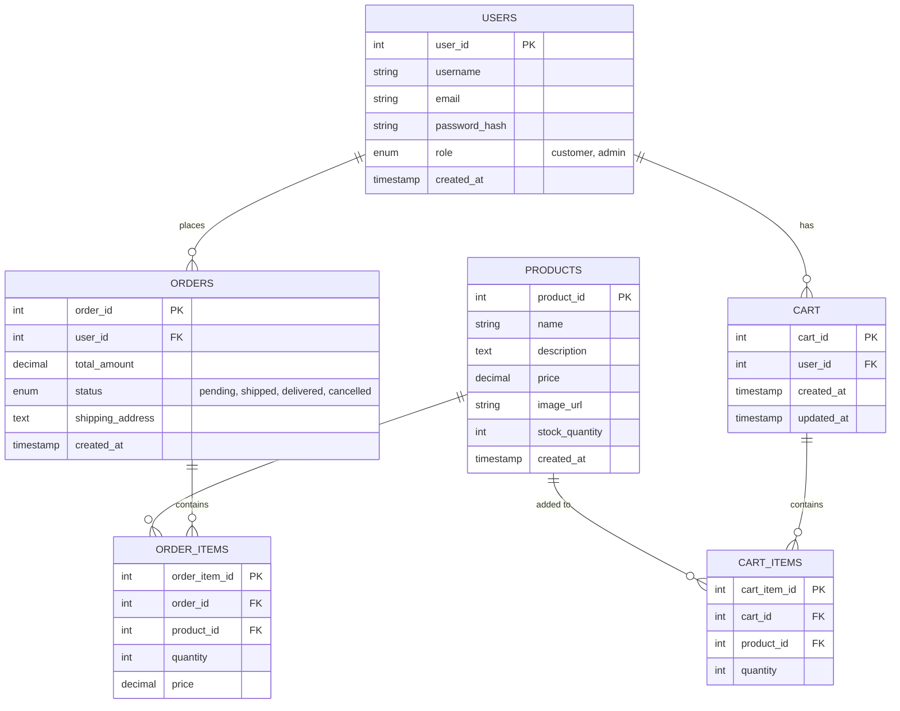

# Database Design for Herbhari E-Commerce

This document outlines the database structure for the Herbhari e-commerce website. It includes an Entity-Relationship (ER) diagram, detailed table descriptions, and the SQL queries required to create the database schema.

## Entity-Relationship Diagram



## Table Structures

### 1. Users Table
Stores customer and admin information.

| Column Name | Data Type | Constraints | Description |
|-------------|-----------|-------------|-------------|
| `user_id` | INT | PRIMARY KEY, AUTO_INCREMENT | Unique identifier for the user |
| `username` | VARCHAR(50) | NOT NULL | User's display name |
| `email` | VARCHAR(100) | NOT NULL, UNIQUE | User's email address |
| `mobile_number` | VARCHAR(20) | NULL | User's mobile phone number |
| `address` | TEXT | NULL | Default shipping address |
| `password_hash` | VARCHAR(255) | NOT NULL | Securely hashed password |
| `role` | ENUM | DEFAULT 'customer' | Role: 'customer' or 'admin' |
| `created_at` | TIMESTAMP | DEFAULT CURRENT_TIMESTAMP | Account creation time |

### 2. Products Table
Stores product details.

| Column Name | Data Type | Constraints | Description |
|-------------|-----------|-------------|-------------|
| `product_id` | INT | PRIMARY KEY, AUTO_INCREMENT | Unique identifier for the product |
| `name` | VARCHAR(100) | NOT NULL | Name of the product |
| `description` | TEXT | NULL | Detailed description of the product |
| `price` | DECIMAL(10, 2) | NOT NULL | Price of the product |
| `image_url` | VARCHAR(255) | NULL | Path or URL to the product image |
| `stock_quantity` | INT | DEFAULT 0 | Current stock level |
| `created_at` | TIMESTAMP | DEFAULT CURRENT_TIMESTAMP | Product entry time |

### 3. Carts Table
Manages active shopping carts for users.

| Column Name | Data Type | Constraints | Description |
|-------------|-----------|-------------|-------------|
| `cart_id` | INT | PRIMARY KEY, AUTO_INCREMENT | Unique identifier for the cart |
| `user_id` | INT | FOREIGN KEY | Links to the User who owns the cart |
| `created_at` | TIMESTAMP | DEFAULT CURRENT_TIMESTAMP | Cart creation time |
| `updated_at` | TIMESTAMP | ON UPDATE CURRENT_TIMESTAMP | Last update time |

### 4. Cart_Items Table
Stores individual items within a shopping cart.

| Column Name | Data Type | Constraints | Description |
|-------------|-----------|-------------|-------------|
| `cart_item_id` | INT | PRIMARY KEY, AUTO_INCREMENT | Unique identifier for the cart item |
| `cart_id` | INT | FOREIGN KEY | Links to the Cart |
| `product_id` | INT | FOREIGN KEY | Links to the Product |
| `quantity` | INT | DEFAULT 1 | Quantity of the product |

### 5. Orders Table
Stores order information after checkout.

| Column Name | Data Type | Constraints | Description |
|-------------|-----------|-------------|-------------|
| `order_id` | INT | PRIMARY KEY, AUTO_INCREMENT | Unique identifier for the order |
| `user_id` | INT | FOREIGN KEY | Links to the User who placed the order |
| `total_amount` | DECIMAL(10, 2) | NOT NULL | Total cost of the order |
| `status` | ENUM | DEFAULT 'pending' | Order status |
| `shipping_address` | TEXT | NOT NULL | Address for delivery |
| `created_at` | TIMESTAMP | DEFAULT CURRENT_TIMESTAMP | Order placement time |

### 6. Order_Items Table
Stores the products included in a finalized order. It records the price at the time of purchase to handle future price changes.

| Column Name | Data Type | Constraints | Description |
|-------------|-----------|-------------|-------------|
| `order_item_id` | INT | PRIMARY KEY, AUTO_INCREMENT | Unique identifier for the order item |
| `order_id` | INT | FOREIGN KEY | Links to the Order |
| `product_id` | INT | FOREIGN KEY | Links to the Product |
| `quantity` | INT | NOT NULL | Quantity ordered |
| `price` | DECIMAL(10, 2) | NOT NULL | Price per unit at time of order |

## SQL Creation Queries

You can run the following SQL commands in your database management tool (e.g., phpMyAdmin) to create the tables.

```sql
-- Create Users Table
CREATE TABLE users (
    user_id INT AUTO_INCREMENT PRIMARY KEY,
    username VARCHAR(50) NOT NULL,
    email VARCHAR(100) NOT NULL UNIQUE,
    mobile_number VARCHAR(20),
    address TEXT,
    password_hash VARCHAR(255) NOT NULL,
    role ENUM('customer', 'admin') DEFAULT 'customer',
    created_at TIMESTAMP DEFAULT CURRENT_TIMESTAMP
);

-- Create Products Table
CREATE TABLE products (
    product_id INT AUTO_INCREMENT PRIMARY KEY,
    name VARCHAR(100) NOT NULL,
    description TEXT,
    price DECIMAL(10, 2) NOT NULL,
    image_url VARCHAR(255),
    stock_quantity INT DEFAULT 0,
    created_at TIMESTAMP DEFAULT CURRENT_TIMESTAMP
);

-- Create Carts Table
CREATE TABLE carts (
    cart_id INT AUTO_INCREMENT PRIMARY KEY,
    user_id INT NOT NULL,
    created_at TIMESTAMP DEFAULT CURRENT_TIMESTAMP,
    updated_at TIMESTAMP DEFAULT CURRENT_TIMESTAMP ON UPDATE CURRENT_TIMESTAMP,
    FOREIGN KEY (user_id) REFERENCES users(user_id) ON DELETE CASCADE
);

-- Create Cart Items Table
CREATE TABLE cart_items (
    cart_item_id INT AUTO_INCREMENT PRIMARY KEY,
    cart_id INT NOT NULL,
    product_id INT NOT NULL,
    quantity INT DEFAULT 1,
    FOREIGN KEY (cart_id) REFERENCES carts(cart_id) ON DELETE CASCADE,
    FOREIGN KEY (product_id) REFERENCES products(product_id) ON DELETE CASCADE
);

-- Create Orders Table
CREATE TABLE orders (
    order_id INT AUTO_INCREMENT PRIMARY KEY,
    user_id INT NOT NULL,
    total_amount DECIMAL(10, 2) NOT NULL,
    status ENUM('pending', 'shipped', 'delivered', 'cancelled') DEFAULT 'pending',
    shipping_address TEXT NOT NULL,
    created_at TIMESTAMP DEFAULT CURRENT_TIMESTAMP,
    FOREIGN KEY (user_id) REFERENCES users(user_id) ON DELETE CASCADE
);

-- Create Order Items Table
CREATE TABLE order_items (
    order_item_id INT AUTO_INCREMENT PRIMARY KEY,
    order_id INT NOT NULL,
    product_id INT NOT NULL,
    quantity INT NOT NULL,
    price DECIMAL(10, 2) NOT NULL,
    FOREIGN KEY (order_id) REFERENCES orders(order_id) ON DELETE CASCADE,
    FOREIGN KEY (product_id) REFERENCES products(product_id) ON DELETE CASCADE
);
```

## Implementation Notes

- **Password Security**: Always hash passwords using `password_hash()` in PHP before storing them in the `password_hash` column.
- **Order Items**: The `order_items` table includes a `price` column. This is important to preserve the price of the item *at the time of purchase*, even if the product price changes later in the `products` table.
- **Foreign Keys**: `ON DELETE CASCADE` is set for most relationships to ensure that if a user or order is deleted, the related items are also cleaned up. Adjust this based on your specific data retention policies.
